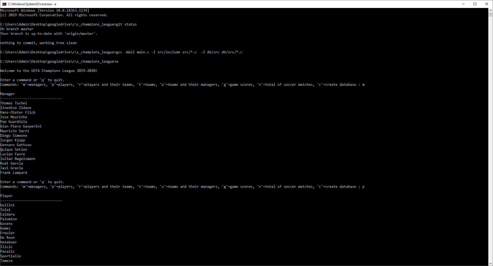
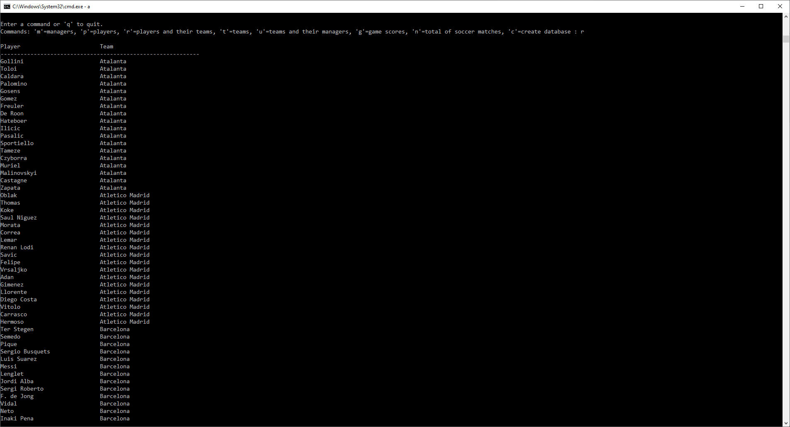
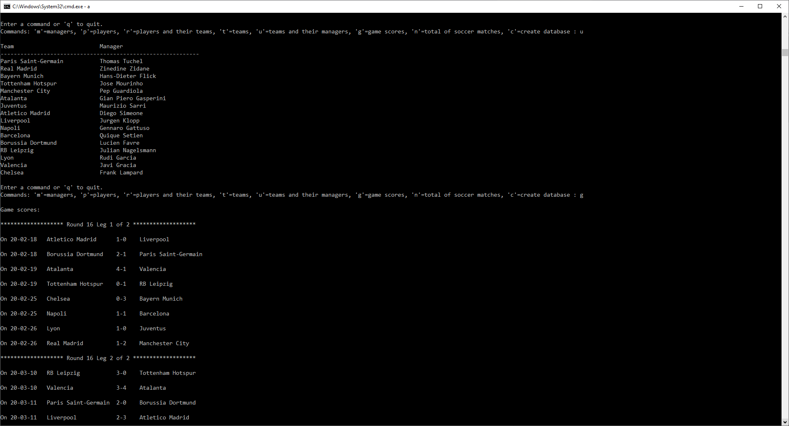
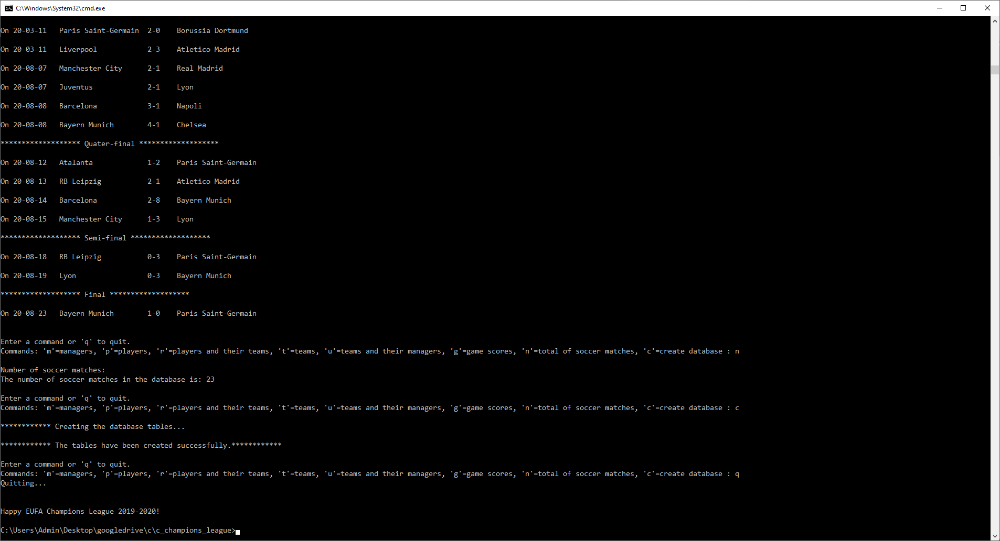

This program written in C displays information about the 2019-2020 UEFA Champions League competition. To store this information, I built a small relational database from scratch using the C language.

I am using the gcc compiler on Windows 10 but you can use an IDE like Visual Studio if you want. 

To find out how to install and run the gcc compiler on Windows 10 follow this link: https://www.youtube.com/watch?v=40MWdFAGTzg

The database of this project consists of the files manager.bin, team.bin, player.bin, match.bin and round.bin located in the db/data folder. To create them select the 'c' option from the main menu.

In order to run the main program you need to compile it first. Here are the steps:

 1- cd c_champions_league
 
 2- gcc -Wall main.c -I ./src/include src/*.c  -I db/src db/src/*.c   -o champions_league.exe

And finally run it:

 1- c_champions_league>champions_league.exe

Output:

